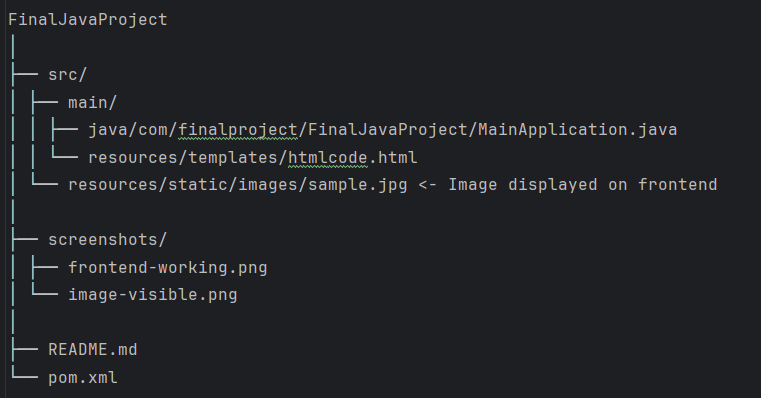

# Final Java Project (Java Labs)

## ✍️ Description

This is my final project for Java Labs. 
The application is a Spring Boot web project that accepts parameters directly from the URL and displays them dynamically on the frontend. It also includes a simple HTML page using Thymeleaf, and a sample image is displayed to show that the frontend is functional.

The main goal was to:
- Create a Spring Boot application.
- Handle dynamic input from the URL.
- Display it on a working frontend using Thymeleaf.
- Add an image to confirm the frontend is active.
- Create an opportunity to write anything you want (with 4 parts) to the URL itself, in one word, make a **CustomURL**
- Upload the entire project to GitHub with README file.

---

## 🚀 How It Works

Once the application is running, you can open your browser and visit a URL like this:

http://localhost:8080/FaigAliyev68741/Group3/FinalJavaProject/Welcome-To-My-Final-Page/

Where:
- `FaigAliyev68741` is treated as the username,
- `Group3` as the group number,
- `FinalJavaProject` as the project name,
- `Welcome-To-My-Final-Page` is the welcome message **(with dashes automatically converted to spaces in the view)**.

The app will read these parts from the URL, process them, and display a complete message on the HTML page.

---

## 🖼️ Screenshots

### ✅ Screenshot 1: Frontend displaying custom URL input

> This shows that the values from the URL were successfully displayed on the webpage using Thymeleaf.

### 🖼️ Screenshot 2: Image on the page (frontend working)

> As required, this confirms that an image is displayed on the frontend and the page is fully working.

---

## 📁 Project Structure (Simplified)

---

## 📸 Image on Frontend

To confirm that the frontend is active, I added an image located in the `static/images/` folder, and it’s being shown properly on the webpage.

---

## ✅ Requirements Met

- [x] Java Spring Boot app created
- [x] Custom message shown from URL parameters
- [x] Frontend working with Thymeleaf
- [x] Screenshot of frontend with message shown
- [x] Screenshot with an image on the page
- [x] README file created and pushed to GitHub ✅

---

## 🔗 GitHub Repository

> The full project is available at:  
👉 [https://github.com/Faig05/Java_Final_Homework_Updated](https://github.com/Faig05/Java_Final_Homework_Updated)

---

## 🧑‍🎓 Author

**Faig Aliyev**  
Student ID: 68741, Group 3  
Java Labs Final Project

